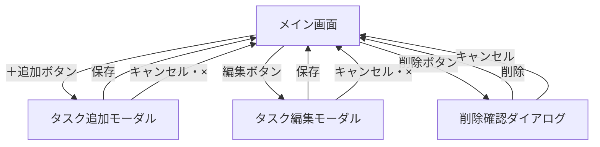

# 画面設計

## 文書情報

| 項目 | 内容 |
|------|------|
| バージョン | 1.0 |
| 作成日 | 2026-06-05 |
| 作成者 | Mtm-Nkmr |
| 変更履歴 | GitHubのコミット履歴を参照 |

---

## 1. 画面一覧

| 画面名 | 概要 |
|--------|------|
| メイン画面 | タスク一覧をカンバン形式で表示する唯一の画面 |
| タスク追加モーダル | タスクを新規追加するポップアップ |
| タスク編集モーダル | 既存タスクを編集するポップアップ |
| 削除確認ダイアログ | タスク削除前の確認ポップアップ |

---

## 2. 画面詳細

### 2-1. メイン画面

```
┌──────────────────────────────────────────────────────────────┐
│  タスク管理アプリ                   [期限順に並び替え]        │
├──────────────┬──────────────┬──────────────────────────────── │
│    未着手    │   進行中     │            完了                 │
│──────────────│──────────────│─────────────────────────────────│
│ ┌──────────┐ │ ┌──────────┐ │                                 │
│ │ タスクA  │ │ │ タスクC  │ │                                 │
│ │ 期限:6/10│ │ │ 期限:6/5 │ │                                 │
│ │          │ │ │ ※期限切れ│ │                                 │
│ │[編集][削除│ │ │[編集][削除                                  │
│ └──────────┘ │ └──────────┘ │                                 │
│ ┌──────────┐ │              │                                 │
│ │ タスクB  │ │              │                                 │
│ │ 期限なし │ │              │                                 │
│ │[編集][削除│ │              │                                 │
│ └──────────┘ │              │                                 │
│  [＋ 追加]  │  [＋ 追加]  │  [＋ 追加]                      │
└──────────────┴──────────────┴─────────────────────────────────┘
```

| 要素 | 仕様 |
|------|------|
| ヘッダー | アプリ名 ＋ 並び替えボタンを表示 |
| カラム | 「未着手」「進行中」「完了」の3列固定 |
| タスクカード | タイトル・期限を表示。期限切れは赤字表示 |
| ドラッグ＆ドロップ | カードをつかんで別カラムに移動できる |
| ＋追加ボタン | 各カラムの末尾に配置。クリックで追加モーダルを開く |
| 並び替えボタン | クリックで期限が近い順に並び替え。もう一度押すと追加順に戻す |

---

### 2-2. タスク追加モーダル

```
┌──────────────────────────────────┐
│  タスクを追加              [ × ] │
│──────────────────────────────────│
│  タイトル ※必須                  │
│  ┌────────────────────────────┐  │
│  │                            │  │
│  └────────────────────────────┘  │
│                                  │
│  期限（任意）                    │
│  ┌────────────────────────────┐  │
│  │  📅 日付を選択             │  │
│  └────────────────────────────┘  │
│                                  │
│        [キャンセル]  [保存]      │
└──────────────────────────────────┘
```

| 項目 | 仕様 |
|------|------|
| タイトル | テキスト入力。必須。空欄で保存しようとするとエラーメッセージを表示 |
| 期限 | カレンダーUIで日付選択。任意入力 |
| 保存ボタン | タイトル入力済みの場合のみ保存してモーダルを閉じる |
| キャンセル / ×ボタン | 入力内容を破棄してモーダルを閉じる |
| 追加先カラム | ＋追加ボタンを押したカラムに追加される |

---

### 2-3. タスク編集モーダル

```
┌──────────────────────────────────┐
│  タスクを編集              [ × ] │
│──────────────────────────────────│
│  タイトル ※必須                  │
│  ┌────────────────────────────┐  │
│  │ （既存のタイトルが入力済み）│  │
│  └────────────────────────────┘  │
│                                  │
│  期限（任意）                    │
│  ┌────────────────────────────┐  │
│  │  📅 （既存の日付が選択済み）│  │
│  └────────────────────────────┘  │
│                                  │
│        [キャンセル]  [保存]      │
└──────────────────────────────────┘
```

| 項目 | 仕様 |
|------|------|
| 初期値 | 既存のタイトル・期限が入力済みの状態で開く |
| 保存ボタン | タイトル入力済みの場合のみ更新してモーダルを閉じる |
| キャンセル / ×ボタン | 変更内容を破棄してモーダルを閉じる |

---

### 2-4. 削除確認ダイアログ

```
┌──────────────────────────────────┐
│  タスクを削除しますか？          │
│──────────────────────────────────│
│                                  │
│  「タスクA」を削除します。       │
│  この操作は元に戻せません。      │
│                                  │
│        [キャンセル]  [削除]      │
└──────────────────────────────────┘
```

| 項目 | 仕様 |
|------|------|
| タスク名表示 | 削除対象のタイトルをダイアログ内に表示する |
| 削除ボタン | タスクを削除してダイアログを閉じる |
| キャンセルボタン | 削除せずダイアログを閉じる |

---

## 3. 画面遷移図



| 操作 | 遷移元 | 遷移先 | 備考 |
|------|--------|--------|------|
| ＋追加ボタン押下 | メイン画面 | タスク追加モーダル | 押したカラムを記憶する |
| 編集ボタン押下 | メイン画面 | タスク編集モーダル | 対象タスクの情報を引き継ぐ |
| 削除ボタン押下 | メイン画面 | 削除確認ダイアログ | 対象タスクのタイトルを引き継ぐ |
| 保存ボタン押下（追加） | タスク追加モーダル | メイン画面 | タスクを追加して閉じる |
| 保存ボタン押下（編集） | タスク編集モーダル | メイン画面 | タスクを更新して閉じる |
| 削除ボタン押下 | 削除確認ダイアログ | メイン画面 | タスクを削除して閉じる |
| キャンセル / ×ボタン | 各モーダル・ダイアログ | メイン画面 | 変更を破棄して閉じる |
| D&Dでカード移動 | メイン画面 | メイン画面（画面内） | 画面遷移なし。ステータスを更新 |
| 並び替えボタン押下 | メイン画面 | メイン画面（画面内） | 画面遷移なし。表示順を切り替え |

- このアプリはシングルページ（1画面）構成のため、ページ遷移は発生しない
- モーダルとダイアログはオーバーレイ表示（メイン画面の上に重なる）
- モーダル表示中は背景（メイン画面）の操作を無効にする
