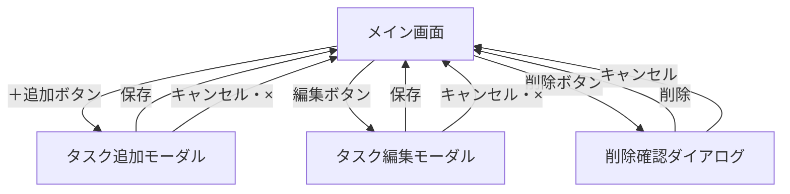

# 要件定義書

## 0. 文書情報

| 項目 | 内容 |
|------|------|
| バージョン | 1.0 |
| 作成日 | 2026-06-05 |
| 作成者 | Mtm-Nkmr |
| 変更履歴 | GitHubのコミット履歴を参照 |

---

## 1. 背景・目的

### 背景

本アプリはWebプログラミングスクールの課題として作成するものである。フロントエンドからバックエンド・データベースまでを含むWebアプリケーション開発の基礎を学ぶことが目的である。

### 目的

- HTML / CSS / JavaScript によるUI実装を習得する
- Node.js + Express によるバックエンド開発を習得する
- SQLite を用いたデータベース設計・操作を習得する
- タスク管理というシンプルなドメインを通じて、CRUD操作の実装を習得する

---

## 2. アプリ概要

| 項目 | 内容 |
|------|------|
| アプリ名 | タスク管理アプリ（Trello風） |
| 概要 | タスクをカンバンボード形式で視覚的に管理し、作業の進捗を把握しやすくするWebアプリ |
| 利用者 | 個人（シングルユーザー） |
| 動作環境 | Webブラウザ（Google Chrome 最新版） |

---

## 3. ユースケース

### 3-1. ユースケース一覧

| UC番号 | ユースケース名 | 概要 |
|--------|--------------|------|
| UC-01 | タスクを追加する | カラムにタスクを新規追加する |
| UC-02 | タスクを編集する | 既存タスクのタイトル・期限を変更する |
| UC-03 | タスクを削除する | 不要なタスクを削除する |
| UC-04 | タスクを移動する | ドラッグ＆ドロップでタスクを別のカラムに移動する |
| UC-05 | 期限切れを確認する | 期限が過ぎたタスクを視覚的に把握する |
| UC-06 | タスクを並び替える | 期限が近い順にタスクを並び替える |

---

### UC-01: タスクを追加する

| 項目 | 内容 |
|------|------|
| アクター | ユーザー |
| 事前条件 | メイン画面が表示されている |
| 事後条件 | タスクが指定カラムに追加される |

**基本フロー**
1. ユーザーが任意のカラムの「＋追加」ボタンを押す
2. タスク追加モーダルが開く
3. ユーザーがタイトルを入力する
4. ユーザーが期限を選択する（任意）
5. ユーザーが「保存」ボタンを押す
6. タスクがカラムに追加され、モーダルが閉じる

**例外フロー**
- 3a. タイトルが空欄のまま保存しようとした場合 → エラーメッセージを表示し、保存しない
- 任意のタイミングで「キャンセル」または「×」を押した場合 → 入力を破棄してモーダルを閉じる

---

### UC-02: タスクを編集する

| 項目 | 内容 |
|------|------|
| アクター | ユーザー |
| 事前条件 | 編集対象のタスクが存在する |
| 事後条件 | タスクの内容が更新される |

**基本フロー**
1. ユーザーがタスクカードの「編集」ボタンを押す
2. タスク編集モーダルが開く（既存の値が入力済み）
3. ユーザーがタイトルまたは期限を変更する
4. ユーザーが「保存」ボタンを押す
5. タスクの内容が更新され、モーダルが閉じる

**例外フロー**
- 3a. タイトルを空欄にして保存しようとした場合 → エラーメッセージを表示し、保存しない
- 任意のタイミングで「キャンセル」または「×」を押した場合 → 変更を破棄してモーダルを閉じる

---

### UC-03: タスクを削除する

| 項目 | 内容 |
|------|------|
| アクター | ユーザー |
| 事前条件 | 削除対象のタスクが存在する |
| 事後条件 | タスクが削除される |

**基本フロー**
1. ユーザーがタスクカードの「削除」ボタンを押す
2. 削除確認ダイアログが開く（対象タスク名を表示）
3. ユーザーが「削除」ボタンを押す
4. タスクが削除され、ダイアログが閉じる

**例外フロー**
- 3a. 「キャンセル」を押した場合 → 削除せずダイアログを閉じる

---

### UC-04: タスクを移動する

| 項目 | 内容 |
|------|------|
| アクター | ユーザー |
| 事前条件 | 移動対象のタスクが存在する |
| 事後条件 | タスクのステータスが更新される |

**基本フロー**
1. ユーザーがタスクカードをドラッグする
2. ユーザーが別のカラムにドロップする
3. タスクのステータスが更新され、移動先カラムに表示される

---

### UC-05: 期限切れを確認する

| 項目 | 内容 |
|------|------|
| アクター | ユーザー |
| 事前条件 | 期限付きタスクが存在する |
| 事後条件 | 期限切れタスクが視覚的に識別できる |

**基本フロー**
1. ユーザーがメイン画面を開く
2. 本日の日付を過ぎた期限のタスクが赤字で表示される

---

### UC-06: タスクを並び替える

| 項目 | 内容 |
|------|------|
| アクター | ユーザー |
| 事前条件 | タスクが1件以上存在する |
| 事後条件 | タスクの表示順が切り替わる |

**基本フロー**
1. ユーザーが「期限順に並び替え」ボタンを押す
2. 各カラム内のタスクが期限の近い順に並び替わる（期限なしは末尾）
3. もう一度ボタンを押すと追加順（デフォルト）に戻る

---

## 4. 機能要件

### 4-1. カラム表示

- 「未着手」「進行中」「完了」の3列を左から順に表示する

**受け入れ条件**
- アプリを開いたとき、3列が必ず表示されている
- カラムの順序は固定（変更不可）

---

### 4-2. タスクの追加

- 各カラムにタスクを追加できる
- タスクには「タイトル（必須）」と「期限（任意）」を入力できる
- 期限はカレンダー形式で選択できる

**受け入れ条件**
- 「＋追加」ボタンを押すとモーダルが開く
- タイトルを入力して保存すると、そのカラムの末尾にタスクが追加される
- タイトルが空欄の場合はエラーメッセージを表示し、保存できない
- 期限なしでも保存できる

---

### 4-3. タスクの編集

- 追加済みのタスクのタイトル・期限を変更できる

**受け入れ条件**
- 「編集」ボタンを押すと既存値が入力済みのモーダルが開く
- タイトルを変更して保存するとカードの表示が更新される
- タイトルを空にして保存しようとするとエラーメッセージを表示し、保存できない

---

### 4-4. タスクの削除

- 不要なタスクを削除できる

**受け入れ条件**
- 「削除」ボタンを押すと確認ダイアログが表示される
- ダイアログ内に削除対象のタスク名が表示される
- 「削除」を押すとタスクが削除される
- 「キャンセル」を押すとタスクは削除されない

---

### 4-5. タスクの移動

- タスクをドラッグ＆ドロップで別のカラムに移動できる

**受け入れ条件**
- カードをつかんで別カラムにドロップするとステータスが更新される
- 移動後もタイトル・期限は保持される

---

### 4-6. 期限切れの表示

- 期限が本日の日付を過ぎたタスクは赤字で表示する

**受け入れ条件**
- 期限が過去日付のタスクは赤字で表示される
- 期限が今日以降のタスクは通常表示
- 期限なしのタスクは通常表示

---

### 4-7. タスクの並び順

- デフォルトは追加した順に表示する
- ボタンで期限が近い順に並び替えられる

**受け入れ条件**
- デフォルトは追加順で表示される
- 「期限順に並び替え」ボタンを押すと期限が近い順に並び替わる
- 期限なしのタスクは末尾に表示される
- もう一度ボタンを押すとデフォルト順に戻る

---

### 4-8. データの保存

- タスクのデータはバックエンドAPIを通じてデータベースに保存する

**受け入れ条件**
- タスクの追加・編集・削除・移動がDBに反映される
- ページをリロードしてもタスクが消えない

---

## 5. 非機能要件

### 5-1. パフォーマンス

| 項目 | 基準 |
|------|------|
| 画面の初回読み込み | 3秒以内 |
| API操作のレスポンス | 1秒以内（タスク100件以下の場合） |

---

### 5-2. セキュリティ

| 項目 | 内容 |
|------|------|
| 入力バリデーション | タイトルの空文字・不正な日付形式などをAPIで検証する |
| SQLインジェクション対策 | SQLはプレースホルダーを使用し、文字列を直接結合しない |
| ログイン機能 | シングルユーザー構成のため不要 |

---

### 5-3. エラー時の挙動

| エラーケース | 挙動 |
|------------|------|
| タイトルが空欄で保存 | モーダル内にエラーメッセージを表示する |
| API通信エラー | 画面上にエラーメッセージを表示する（操作は失敗として扱う） |

---

### 5-4. アクセシビリティ

| 項目 | 内容 |
|------|------|
| Escキー | モーダル・ダイアログをEscキーで閉じられる |
| ボタンラベル | 各ボタンに操作内容がわかるラベルをつける |

---

### 5-5. 対応環境

| 項目 | 内容 |
|------|------|
| 対応ブラウザ | Google Chrome（最新版） |
| スマホ対応 | 対応しない（PCブラウザのみ） |

---

## 6. 制約・前提条件

| 項目 | 内容 |
|------|------|
| フロントエンド | HTML / CSS / JavaScript |
| バックエンド | Node.js + Express |
| データベース | SQLite |
| 利用者数 | 1名（マルチユーザー対応なし） |
| 備考 | スクール課題のため、技術スタックは後から変更される可能性がある |

---

## 7. 画面設計

### 7-1. 画面一覧

| 画面名 | 概要 |
|--------|------|
| メイン画面 | タスク一覧をカンバン形式で表示する唯一の画面 |
| タスク追加モーダル | タスクを新規追加するポップアップ |
| タスク編集モーダル | 既存タスクを編集するポップアップ |
| 削除確認ダイアログ | タスク削除前の確認ポップアップ |

---

### 7-2. メイン画面

```
┌──────────────────────────────────────────────────────────────┐
│  タスク管理アプリ                   [期限順に並び替え]        │
├──────────────┬──────────────┬──────────────────────────────── │
│    未着手    │   進行中     │            完了                 │
│──────────────│──────────────│─────────────────────────────────│
│ ┌──────────┐ │ ┌──────────┐ │                                 │
│ │ タスクA  │ │ │ タスクC  │ │                                 │
│ │ 期限:6/10│ │ │ 期限:6/5 │ │                                 │
│ │          │ │ │ ※期限切れ│ │                                 │
│ │[編集][削除│ │ │[編集][削除                                  │
│ └──────────┘ │ └──────────┘ │                                 │
│ ┌──────────┐ │              │                                 │
│ │ タスクB  │ │              │                                 │
│ │ 期限なし │ │              │                                 │
│ │[編集][削除│ │              │                                 │
│ └──────────┘ │              │                                 │
│  [＋ 追加]  │  [＋ 追加]  │  [＋ 追加]                      │
└──────────────┴──────────────┴─────────────────────────────────┘
```

| 要素 | 仕様 |
|------|------|
| ヘッダー | アプリ名 ＋ 並び替えボタンを表示 |
| カラム | 「未着手」「進行中」「完了」の3列固定 |
| タスクカード | タイトル・期限を表示。期限切れは赤字表示 |
| ドラッグ＆ドロップ | カードをつかんで別カラムに移動できる |
| ＋追加ボタン | 各カラムの末尾に配置。クリックで追加モーダルを開く |
| 並び替えボタン | クリックで期限が近い順に並び替え。もう一度押すと追加順に戻す |

---

### 7-3. タスク追加モーダル

```
┌──────────────────────────────────┐
│  タスクを追加              [ × ] │
│──────────────────────────────────│
│  タイトル ※必須                  │
│  ┌────────────────────────────┐  │
│  │                            │  │
│  └────────────────────────────┘  │
│                                  │
│  期限（任意）                    │
│  ┌────────────────────────────┐  │
│  │  📅 日付を選択             │  │
│  └────────────────────────────┘  │
│                                  │
│        [キャンセル]  [保存]      │
└──────────────────────────────────┘
```

| 項目 | 仕様 |
|------|------|
| タイトル | テキスト入力。必須。空欄で保存しようとするとエラーメッセージを表示 |
| 期限 | カレンダーUIで日付選択。任意入力 |
| 保存ボタン | タイトル入力済みの場合のみ保存してモーダルを閉じる |
| キャンセル / ×ボタン | 入力内容を破棄してモーダルを閉じる |
| 追加先カラム | ＋追加ボタンを押したカラムに追加される |

---

### 7-4. タスク編集モーダル

```
┌──────────────────────────────────┐
│  タスクを編集              [ × ] │
│──────────────────────────────────│
│  タイトル ※必須                  │
│  ┌────────────────────────────┐  │
│  │ （既存のタイトルが入力済み）│  │
│  └────────────────────────────┘  │
│                                  │
│  期限（任意）                    │
│  ┌────────────────────────────┐  │
│  │  📅 （既存の日付が選択済み）│  │
│  └────────────────────────────┘  │
│                                  │
│        [キャンセル]  [保存]      │
└──────────────────────────────────┘
```

| 項目 | 仕様 |
|------|------|
| 初期値 | 既存のタイトル・期限が入力済みの状態で開く |
| 保存ボタン | タイトル入力済みの場合のみ更新してモーダルを閉じる |
| キャンセル / ×ボタン | 変更内容を破棄してモーダルを閉じる |

---

### 7-5. 削除確認ダイアログ

```
┌──────────────────────────────────┐
│  タスクを削除しますか？          │
│──────────────────────────────────│
│                                  │
│  「タスクA」を削除します。       │
│  この操作は元に戻せません。      │
│                                  │
│        [キャンセル]  [削除]      │
└──────────────────────────────────┘
```

| 項目 | 仕様 |
|------|------|
| タスク名表示 | 削除対象のタイトルをダイアログ内に表示する |
| 削除ボタン | タスクを削除してダイアログを閉じる |
| キャンセルボタン | 削除せずダイアログを閉じる |

---

## 8. 画面遷移図



| 操作 | 遷移元 | 遷移先 | 備考 |
|------|--------|--------|------|
| ＋追加ボタン押下 | メイン画面 | タスク追加モーダル | 押したカラムを記憶する |
| 編集ボタン押下 | メイン画面 | タスク編集モーダル | 対象タスクの情報を引き継ぐ |
| 削除ボタン押下 | メイン画面 | 削除確認ダイアログ | 対象タスクのタイトルを引き継ぐ |
| 保存ボタン押下（追加） | タスク追加モーダル | メイン画面 | タスクを追加して閉じる |
| 保存ボタン押下（編集） | タスク編集モーダル | メイン画面 | タスクを更新して閉じる |
| 削除ボタン押下 | 削除確認ダイアログ | メイン画面 | タスクを削除して閉じる |
| キャンセル / ×ボタン | 各モーダル・ダイアログ | メイン画面 | 変更を破棄して閉じる |
| D&Dでカード移動 | メイン画面 | メイン画面（画面内） | 画面遷移なし。ステータスを更新 |
| 並び替えボタン押下 | メイン画面 | メイン画面（画面内） | 画面遷移なし。表示順を切り替え |

- このアプリはシングルページ（1画面）構成のため、ページ遷移は発生しない
- モーダルとダイアログはオーバーレイ表示（メイン画面の上に重なる）
- モーダル表示中は背景（メイン画面）の操作を無効にする

---

## 9. データ設計（ER図）

### 概要

シングルユーザー構成のため、テーブルは **`tasks` の1つのみ**です。

### テーブル図

```
┌─────────────────────────────┐
│           tasks             │
├──────────────┬──────────────┤
│ id           │ INTEGER (PK) │
│ title        │ TEXT         │
│ status       │ TEXT         │
│ due_date     │ DATE         │
│ sort_order   │ INTEGER      │
│ created_at   │ DATETIME     │
│ updated_at   │ DATETIME     │
└──────────────┴──────────────┘
```

### テーブル定義：tasks

| カラム名 | 型 | NULL | デフォルト値 | 説明 |
|----------|----|------|-------------|------|
| id | INTEGER | NOT NULL | 自動採番 | 主キー（タスクを一意に識別する番号） |
| title | TEXT | NOT NULL | なし | タスクのタイトル |
| status | TEXT | NOT NULL | `'todo'` | タスクの状態（下記参照） |
| due_date | DATE | NULL可 | NULL | 期限日。未入力の場合はNULL |
| sort_order | INTEGER | NOT NULL | `0` | カラム内の並び順（小さいほど上） |
| created_at | DATETIME | NOT NULL | 現在日時 | レコード作成日時 |
| updated_at | DATETIME | NOT NULL | 現在日時 | レコード更新日時 |

### statusの値

| 値 | 画面表示 | 意味 |
|----|----------|------|
| `todo` | 未着手 | まだ手をつけていないタスク |
| `in_progress` | 進行中 | 作業中のタスク |
| `done` | 完了 | 完了したタスク |

---

## 10. 対象外

最初のバージョンでは以下は作りません。

- ログイン・ユーザー管理
- 複数人での共有
- カラムの追加・削除
- タスクへの色付け・ラベル機能
- スマホ対応（レスポンシブデザイン）
- タスクの説明欄
- タスクのピン止め・カラム内での自由な並び替え
